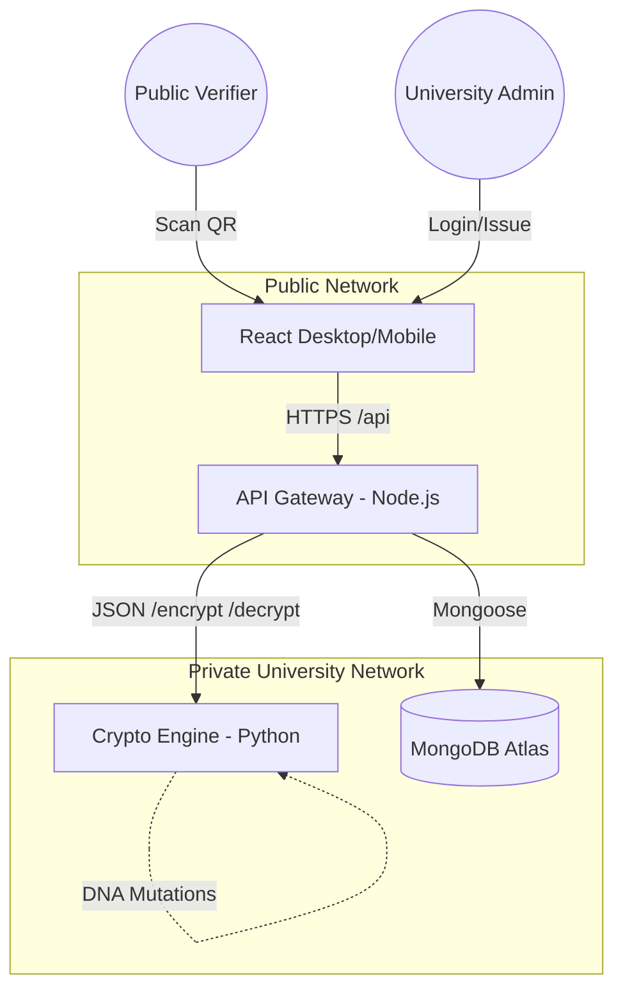

# 🎓 University Certificate Verification System (UCVS)

> A high-security, microservices-based platform designed to issue and verify official academic certificates using **DNA-encoding cryptography**. By combining AES-256 encryption, chaotic logistic map sequences, and nucleotide base substitutions (A, T, C, G), the UCVS ensures that every digital record is mathematically tamper-proof and verifiable against state-level forgery attempts.

---

## ✨ Features & Innovation

- 🧬 **DNA-Sequence Encryption** — Certificate data is not just hashed; it is actively mutated into a synthetic DNA nucleotide sequence. This payload is stored in MongoDB, ensuring that even a database breach yields no readable student data.
- 🛡️ **Cryptographic Tamper Detection** — Uses embedded SHA-256 fingerprints within the DNA sequence. If even a single character ('A' instead of 'T') is changed in the database, the decryption process will instantly catch the mismatch and flag the certificate as `TAMPERED`.
- 🏢 **Role-Based Academic Control (RBAC)** — Three distinct permission tiers powered by JWT:
    - **`SuperAdmin`** — Global oversight, user management, and the exclusive power to `Revoke` certificates.
    - **`HOD`** — Department-level management with full `Issue` and `Registry` visibility.
    - **`Clerk`** — View-only access to the Registry for administrative tracking and student support.
- 📱 **QR Code Ecosystem** — Automatic generation of unique verification QR codes for every certificate, allowing instant mobile scanning with no specialized app required.
- 🖨️ **Premium Print Views** — Optimized CSS for high-fidelity A4 printing. Certificates look like traditional paper diplomas with modern cryptographic security features (seals, ID badges, and micro-text).
- ⚡ **Performance & Security** — Production-grade rate limiting (Login/Verification), XSS sanitization, and isolated internal microservice communication via a private network backbone.

---

## 🏛️ System Architecture



### Microservice Breakdown
1.  **[Frontend](./frontend/)** — React 18, Vite, TypeScript. The user portal (Login, Dashboard, Public Verify).
2.  **[API Gateway](./api-gateway/)** — Node.js, Express. Orchestrates Auth, DB, and QR services. Enforces RBAC.
3.  **[Crypto Engine](./crypto-engine/)** — Python, FastAPI. The mathematical core. Handles AES, Chaotic Maps, and DNA encoding.

---

## 🛠️ Technology Stack & Dependencies

| Layer | Core Technologies | Focus |
|---|---|---|
| **UI/UX** | React 18, Tailwind CSS, Headless UI | Speed, Accessibility, and Aesthetics |
| **Logic** | Node.js (ESM), Python 3.11+ | Performance & Mathematical Precision |
| **Security** | JWT, bcryptjs, cryptography.io, SHA-256 | Authentication & Secure Storage |
| **Storage** | MongoDB Atlas, Mongoose v8 | Resilient & Scalable Data Management |
| **DevOps** | Docker Desktop, Docker Compose, Render | Seamless Containerized Orchestration |

---

## 🚀 Quick Setup (Development Mode)

### 1. Clone & Configure
```bash
git clone https://github.com/your-org/ucvs.git
cd ucvs

# Setup Environment Templates
cp crypto-engine/.env.example crypto-engine/.env
cp api-gateway/.env.example api-gateway/.env
cp frontend/.env.example frontend/.env
```
*(Open each `.env` and fill in your keys. Use `openssl rand -base64 32` for secrets.)*

### 2. Launch with Docker
Execute this from the project root:
```bash
docker-compose up --build
```
The system will be accessible at `http://localhost`.

### 3. Setup Initial Admin
```bash
# This creates a root SuperAdmin account
curl -X POST http://localhost:5000/api/auth/register \
  -H "Content-Type: application/json" \
  -d '{"email":"admin@university.edu","password":"SecurePassword123","role":"SuperAdmin","department":"CS"}'
```

---

## 🏷️ Development & Deployment Workflows

- **Frontend Development:** Navigate to `frontend/` and run `npm run dev`.
- **Backend Testing:** Navigate to `api-gateway/` and run `npm test`.
- **Crypto Audit:** Navigate to `crypto-engine/` and run `pytest`.
- **Production Build:** Use `npm run build` in each microservice to generate deployment-ready artifacts.

---

## 📁 Technical Documentation Directory

- 🗺️ **[Architecture](./docs/architecture.md)** — Deep dive into data flow and component separation.
- 📡 **[API Specification](./docs/api-spec.md)** — Complete endpoint descriptions and response schemas.
- 🔒 **[Security Guide](./docs/security.md)** — Details on AES-256, DNA rotation, and rate-limiting.
- 🚢 **[Deployment Guide](./docs/deployment.md)** — Production hosting via Render.com and Vercel.
- 📖 **[User Manual](./docs/user-guide.md)** — Guides for Administrators, HODs, and Clerks.

---

## 🤝 Contributing
Contributions are what make the open-source community an amazing place to learn, inspire, and create. Any contributions you make are **greatly appreciated**.

1. Fork the Project
2. Create your Feature Branch (`git checkout -b feature/AmazingFeature`)
3. Commit your Changes (`git commit -m 'Add some AmazingFeature'`)
4. Push to the Branch (`git push origin feature/AmazingFeature`)
5. Open a Pull Request

---

## 📄 License
Distributed under the MIT License. See `LICENSE` for more information.

---
© 2026 University Certification Division. All Rights Reserved.
